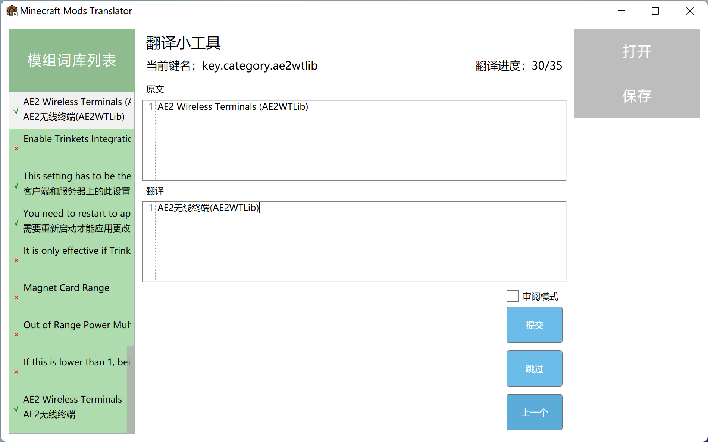
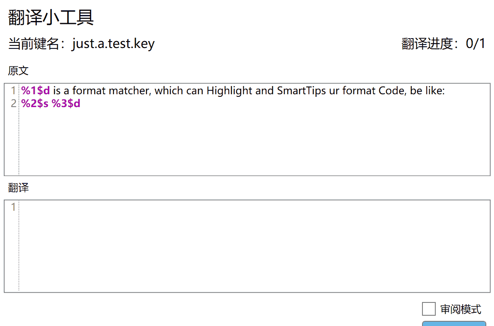
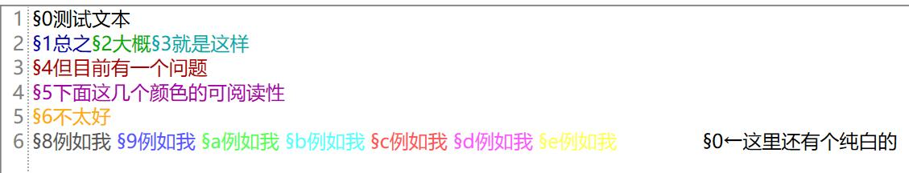

本项目已停止维护，新版本（[Tryanks/WebTranslator](https://github.com/Tryanks/WebTranslator)）正在开发中，可在[cfpatools.github.io](cfpatools.github.io)体验有限功能（仅预览）的网页版。

# Minecraft Mods Translator

适用于Minecraft 1.16+版本的MC模组翻译器

## 使用方法

1.双击打开模组翻译器

2.选中MOD的en_us.json打开

## 软件功能

格式化字符智能提示与比对

染色符号标记

## 计划列表

- [ ] 自动化词典
- [ ] 机翻提示
